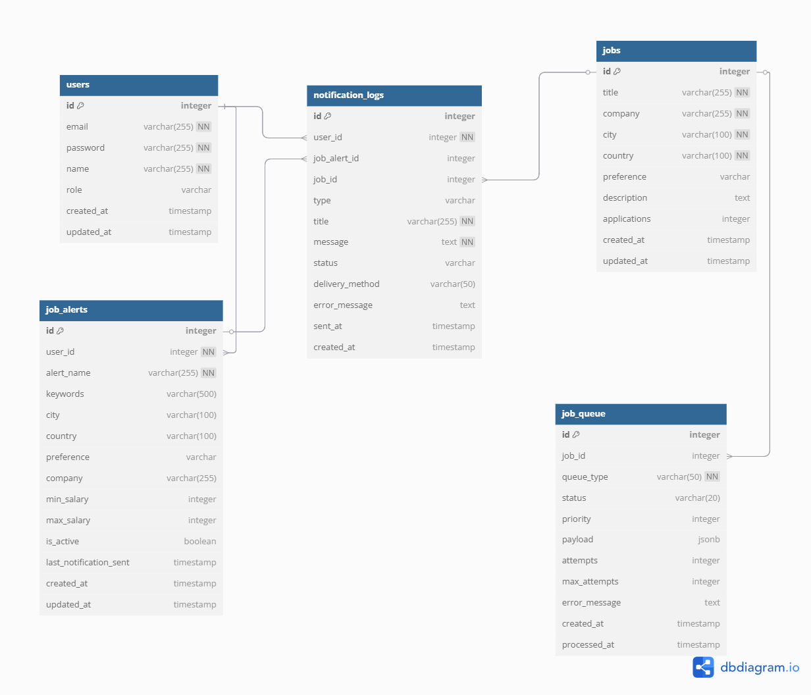

# Job Search Web Application

A cloud-deployable, service-oriented Job Search web application with RESTful APIs, search and filtering capabilities, distributed caching, and modular service design. Built with scalability and future cloud deployment in mind.

---

## 📌 Overview

This application allows users to search for jobs by various criteria such as location, title, and work type. The system is designed to support service-based architecture, real-time filtering, and caching for performance improvements.

---

## 🌐 REST Services

The application is designed with the following service modules, each communicating through RESTful APIs:

- **Job Search Service** – Handles job listing, filtering, and details
- **Notification Service** – Sends messages such as application confirmations
- **Hotel Service (as an additional example domain)** – Provides hotel information (used for testing service modularity)
- **API Gateway** – All API calls are routed through the gateway for abstraction and routing control

All services:
- Follow **RESTful** conventions
- Are **versioned** (e.g., `/api/v1/jobs`)
- Support **pagination** on list endpoints where necessary

---

## 💻 Front-End Functionality

- **Search Functionality**
  - Filter by Position, Country, City, and Work Type
  - Autocomplete suggestions per field
  - Recent searches display
  - Browser-based city detection
- **Job Detail Page**
  - Job title, location, description, posted date, and number of applications
  - Similar jobs section
  - Apply button (auth check included)
- **UI Assumptions**
  - Frontend may differ from mock-ups but replicates functionality

---

## 🧱 Architecture & Technologies

- **Frontend**: React + Tailwind CSS + ShadCN UI
- **Backend**: Node.js (Express) – Service-based modular REST APIs
- **Messaging Queue**: RabbitMQ (planned integration)
- **Distributed Cache**: Redis (used for caching job/hotel details)
- **Database**: Cloud-ready relational DB (e.g., Azure SQL, PostgreSQL)
- **API Gateway**: Custom gateway routing requests to microservices
- **Service Hosting**: Each microservice designed to be hosted independently in cloud environments (e.g., Azure App Services, Google Cloud Run)

---

### 🧠 AI Agent Service

The **AI Agent Service** is a conversational assistant integrated into the main screen of the application. It allows users to search for and apply to jobs using natural language, improving usability and interactivity.

#### 💬 Example Interaction:

**User:**  
İzmir'de iş ilanları arıyorum.  
**AI:**  
Size uygun pozisyonları bulacağım!  
3 adet uygun pozisyon buldum! İşte size uygun olanlar:

- **Mobile Developer**  
  🏢 Yaşar Uni  
  📍 İzmir, Türkiye  
  💼 Tam Zamanlı  
  🔘 [Başvur]

- **Full Stack Developer**  
  🏢 Raynet  
  📍 İzmir, Türkiye  
  💼 Hibrit  
  🔘 [Başvur]

- **React Developer**  
  🏢 FrontendX  
  📍 İzmir, Türkiye  
  💼 Tam Zamanlı  
  🔘 [Başvur]

---

**User:**  
Mobile developer olarak iş arıyorum.  
**AI:**  
Size uygun pozisyonları bulacağım!  
1 adet uygun pozisyon buldum! İşte size uygun olanlar:

- **Mobile Developer**  
  🏢 Yaşar Uni  
  📍 İzmir, Türkiye  
  💼 Tam Zamanlı  
  🔘 [Başvur]

---

#### 🔧 Technical Notes

- Uses backend **REST APIs** to perform search and apply operations.
- No real-time communication is required.
- Conversational UI is embedded as a chat window on the main page.
- Can be extended to use NLP or AI APIs in future versions.

---

## 📊 Data Model Overview

Below is a simplified ER model used in the Job Search service:

**Job Table**
- `id` (PK)
- `title`
- `description`
- `city`
- `country`
- `work_type`
- `posted_at`
- `applications_count`

**User Table** *(for login & saved jobs functionality)*
- `id` (PK)
- `email`
- `password_hash`
- `created_at`

*Other services (e.g., Notification, Hotel) have their own independent models.*

---

## ✅ Assumptions

- City detection is based on browser location APIs
- Real-time messaging for AI Agent **is not required**
- Data persistence is assumed to be handled by cloud-hosted relational databases
- Caching layer is implemented using Redis and is applied to read-heavy endpoints (e.g., Job Details, Hotel Details)
- All REST services are versionable by path segment (e.g., `/api/v1/`)
- Frontend UI is decoupled and interacts only through API Gateway

---

## ⚠️ Issues Encountered

- Geolocation permissions can vary across browsers and affect city detection
- Mock job data was initially used in-memory; later migrated to database-backed services
- Implementing pagination in combination with filtered search required additional state handling
- Some autocomplete dropdown edge cases (e.g., empty inputs, rapid keystrokes) required debouncing logic

---

## 📽️ Demo Video

[[🔗 Link to Project Demo (max 5 mins)]([https://your-video-link.com](https://drive.google.com/file/d/1db0YZkm3PHrOgBbGxwDBYYPXNl1MtvpY/view?usp=sharing))](https://drive.google.com/file/d/1db0YZkm3PHrOgBbGxwDBYYPXNl1MtvpY/view?usp=sharing)

---

## 📂 Project Repository

Public GitHub: [https://github.com/utku1608/job-search-app](https://github.com/utku1608/job-search-app)

---

